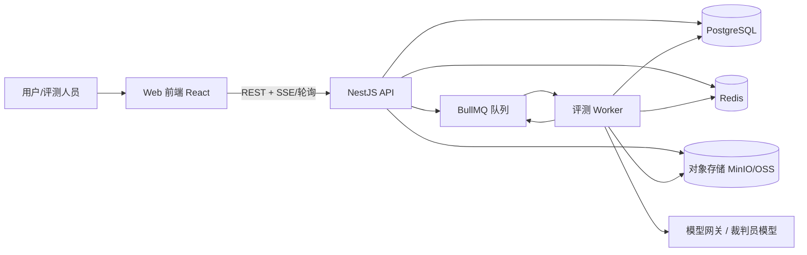
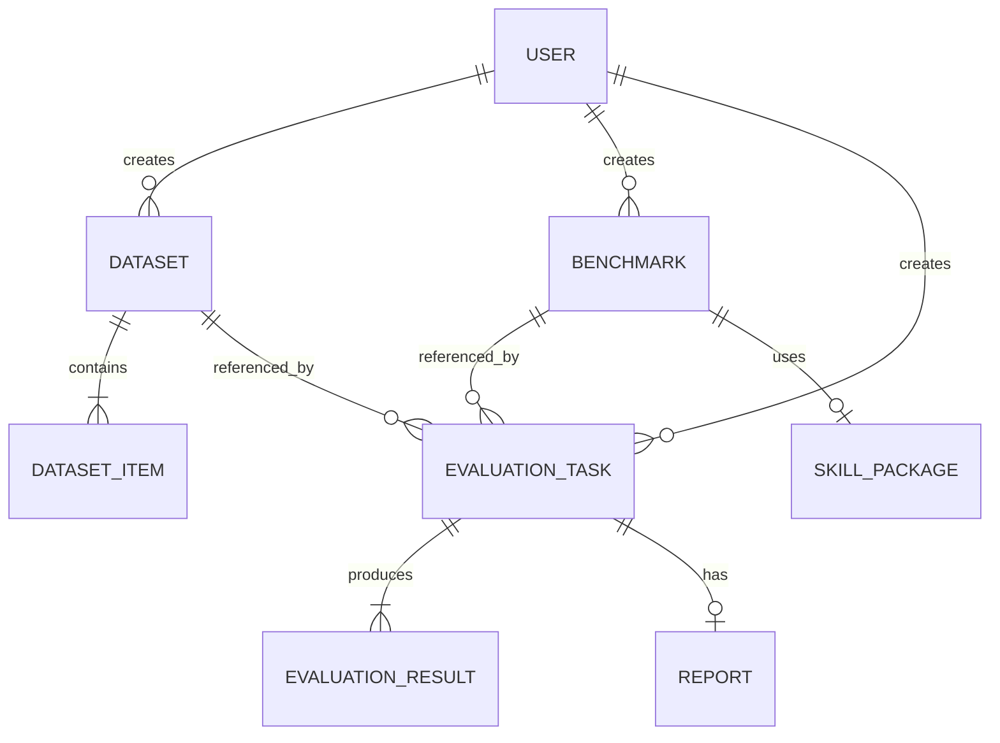
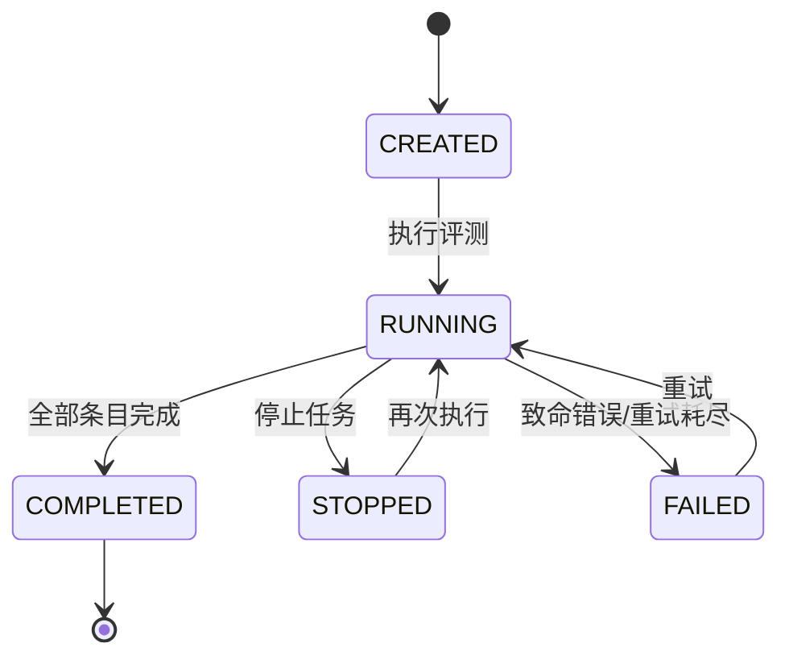
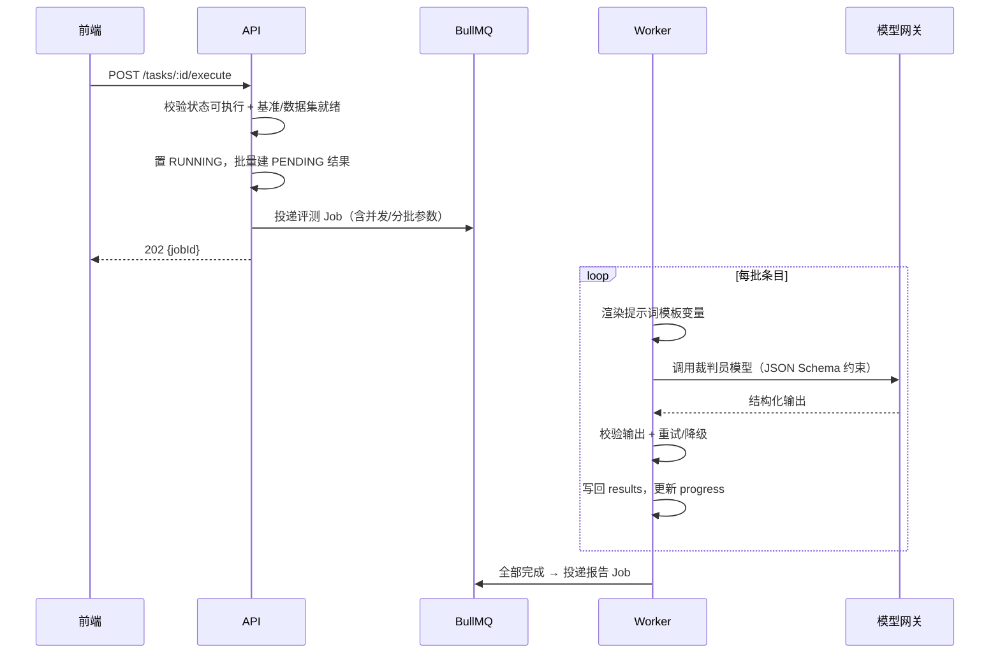
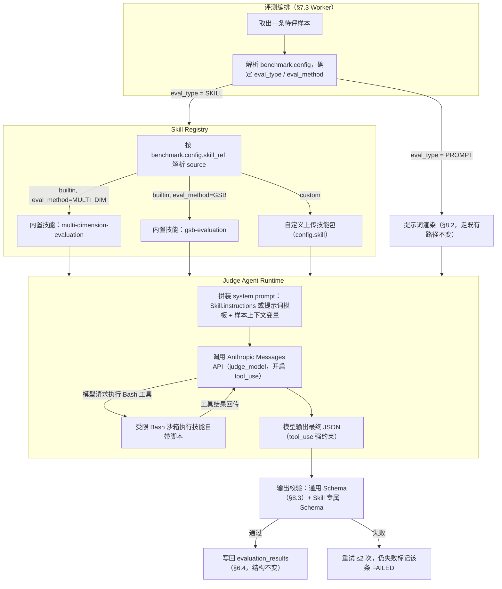

# 智搜策略效果评估 · 技术方案设计

> 版本：v1.0（草案）
> 依据文档：`prd.md`、`CLAUDE.md`、`Design.MD`
> 目标读者：研发、架构、测试、产品

---

## 1. 背景与目标

现有「智搜策略效果评估」全流程依赖人工：捞数、逐条打分、逐条写理由、手工汇总、手工写报告。改造后形成 **“人工定标准 + AI 做执行 + 人工兜置信”** 的评测工作台，将三项能力沉淀为平台内置 Skill：

1. **数据获取 Skill**：自助拉数 + 清洗。
2. **标注 Skill**：分维度打分 + GSB 判定。
3. **报告 Skill**：汇总 + Badcase 聚类 + 报告生成。

本方案聚焦“评测工作台”这一 Web 产品的工程实现，覆盖架构、模块、数据、核心流程、API、非功能与交付计划。

---

## 2. 需求范围速览

| 一级功能 | 核心能力 |
| --- | --- |
| 数据概览 | 核心指标卡，按时间范围统计评估量，按任务类型（通用评估 / 博文分析）区分 |
| 评估中心 | 任务管理、状态机、步骤条（数据准备 → AI评测 → 人工复核 → 报告）、导出测试集、创建任务、费用预估 |
| 数据集 | 列表、上传（CSV/Excel/JSON/JSONL ≤50MB）、字段映射、格式校验定位到行、模板下载、数据源直连（P1） |
| 评估基准 | 基准列表、创建（提示词类型 / Skill）、评估方式（多维度 / GSB）、维度权重校验、版本管理 |
| AI 评估模块 | 评测引擎：承接“数据集 + 评估基准”，产出“评分结果 + 报告”；Excel 读取器填充槽位 |

P0 交付：数据概览、数据集上传、评估基准（提示词类型）、评测任务执行、多维度/GSB 评分、人工复核、报告生成。
P1 交付：数据库直连构建数据集、Skill 类型评估基准、数据源连接管理。

---

## 3. 总体技术选型

遵循 `CLAUDE.md` 分层、TS/Node 20、安全与测试约束；前端落地 `Design.MD` 设计令牌与组件规范。

| 层次 | 选型 | 说明 |
| --- | --- | --- |
| 前端框架 | React 18 + TypeScript 5 | 工作台，复杂表单与表格 |
| 构建 | Vite 5 | 快速开发与构建 |
| 路由 | React Router v6 | SPA 路由 |
| 服务端状态 | TanStack Query v5 | 列表缓存、轮询进度、失效策略 |
| 客户端状态 | Zustand | 轻量全局状态（用户、主题） |
| 表单校验 | react-hook-form + Zod | 与后端 DTO 共用 Schema |
| 表格 | TanStack Table + 虚拟滚动 | 大数据集预览与结果列表 |
| 图表 | ECharts | 数据概览、报告可视化 |
| 样式 | CSS Variables 落地 Design.MD Token | 自研 `packages/ui` 组件库 |
| 后端 | Node.js 20 LTS + TypeScript + NestJS 10 | 模块化分层，符合 Controller→Service→Repository→Model |
| ORM | Prisma + PostgreSQL 16 | 类型安全，JSONB 承载提示词/评分配置 |
| 缓存/队列 | Redis 7 + BullMQ | 异步评测任务、进度、限流 |
| 对象存储 | MinIO（兼容 S3，可换阿里云 OSS） | 数据集文件、技能包、报告产物 |
| AI 接入 | 模型网关适配层 + OpenAI 兼容协议 | 多裁判员模型可插拔，结构化输出 |
| 文件解析 | ExcelJS / PapaParse / stream-json | 流式解析，支持大文件 |
| 可观测性 | OpenTelemetry + Prometheus + Grafana + Loki + pino | 指标、链路、日志 |
| 部署 | Docker / Docker Compose（开发），K8s（生产） | 无状态 API + 独立 Worker |

**架构模式**：前后端分离 + **模块化单体（Modular Monolith）+ Monorepo**。API 与评测 Worker 为独立进程，领域模块内分层，避免过早微服务化。

---

## 4. 总体架构

### 4.1 逻辑架构



### 4.2 进程与职责

| 进程 | 职责 |
| --- | --- |
| `web` | 页面渲染、交互、文件分片/直传、结果预览 |
| `api` | 鉴权、CRUD、数据集解析编排、任务创建/停止/重试、进度查询、报告入口 |
| `worker` | 消费评测队列：调用 LLM、写回结果、更新进度、触发报告生成 |
| `report-worker`（可并入 worker） | Badcase 聚类、汇总、导出 Excel/PDF |

**任务执行原则**：超过 2 秒的评测、报告生成、批量导出全部异步化（符合 `CLAUDE.md` 性能约束）。

---

## 5. 工程结构（Monorepo）

```
ZhiSouAiEvaluate/
├── apps/
│   ├── web/                     # React + Vite 前端
│   ├── api/                     # NestJS API
│   └── worker/                  # 评测/报告异步 Worker
├── packages/
│   ├── shared/                  # 共享 TS 类型、DTO、Zod Schema、常量
│   ├── ui/                      # 基于 Design.MD 的组件库（tokens + 组件）
│   └── config/                  # eslint/tsconfig/prettier 共享配置
├── docs/
├── docker-compose.yml
├── .env.example
└── package.json / pnpm-workspace.yaml
```

### 5.1 后端分层目录（api / worker 共用 domain）

```
apps/api/src/
├── main.ts
├── config/                      # 环境变量集中注入
├── common/                      # 过滤器、拦截器、守卫、装饰器、Result 类型
├── providers/
│   ├── prisma/                  # Prisma Client
│   ├── llm/                     # 模型适配器（可插拔）
│   ├── storage/                 # 对象存储
│   ├── queue/                   # BullMQ 队列定义
│   └── cache/                   # Redis 封装
└── modules/
    ├── auth/
    ├── users/
    ├── datasets/
    ├── benchmarks/
    ├── skills/
    ├── datasources/
    ├── tasks/
    ├── reviews/                 # 人工复核
    ├── reports/
    └── overview/
```

每个模块内部遵循 `routes → controllers → services → repositories → models`，禁止跨层调用、禁止循环依赖。

---

## 6. 数据模型设计

> 以下为 Prisma 模型抽象。`config`、`scores`、`raw_output` 使用 JSONB 以兼容多维度与 GSB 两种评估方式的可变结构。

### 6.1 ER 关系



### 6.2 核心表

**users**

| 字段 | 类型 | 说明 |
| --- | --- | --- |
| id | uuid PK | |
| name | text | 姓名 |
| email | text | 唯一 |
| role | enum | ADMIN / ANALYST / REVIEWER |
| created_at | timestamptz | |

**datasets**

| 字段 | 类型 | 说明 |
| --- | --- | --- |
| id | uuid PK | |
| name | text | 同用户下唯一 |
| description | text | ≤200 |
| source | enum | UPLOAD / DATASOURCE |
| eval_method | enum | MULTI_DIM / GSB |
| format | enum | CSV / EXCEL / JSON / JSONL |
| file_key | text | 对象存储 Key |
| field_mapping | jsonb | 源列 → `{query, content, baseline, extra}` |
| total_items | int | 有效条数 |
| total_chars | bigint | 字数总量 |
| status | enum | PARSING / READY / FAILED |
| error_message | text | 解析失败原因 |
| created_by | uuid FK | |
| created_at / updated_at | timestamptz | |

**dataset_items**

| 字段 | 类型 | 说明 |
| --- | --- | --- |
| id | uuid PK | |
| dataset_id | uuid FK | |
| row_index | int | 原始行号，用于定位错误 |
| query | text | 用户 Query |
| content | text | 待评内容 |
| baseline | text | GSB 基线内容 |
| extra | jsonb | 其他字段 |
| char_count | int | |
| unique(dataset_id, row_index) | | |

**benchmarks**

| 字段 | 类型 | 说明 |
| --- | --- | --- |
| id | uuid PK | |
| name | text | 同评估类型下唯一 |
| description | text | ≤200 |
| type | enum | PROMPT / SKILL |
| eval_method | enum | MULTI_DIM / GSB |
| version | text | 默认 v1.0 |
| status | enum | DRAFT / VERIFIED |
| use_count | int | 被引用次数 |
| config | jsonb | 见 6.3 |
| skill_id | uuid FK | SKILL 类型使用 |
| created_by | uuid FK | |
| created_at / updated_at | timestamptz | |

**skill_packages**

| 字段 | 类型 | 说明 |
| --- | --- | --- |
| id | uuid PK | |
| name / version / description | text | 从技能包 manifest 解析 |
| package_key | text | 对象存储 Key |
| manifest | jsonb | 名称、版本、适用场景、描述 |
| created_by / created_at | | |

**evaluation_tasks**

| 字段 | 类型 | 说明 |
| --- | --- | --- |
| id | uuid PK | 任务 ID |
| name | text | |
| description | text | ≤50 |
| benchmark_id | uuid FK | |
| dataset_id | uuid FK | |
| judge_model | text | 裁判员模型标识 |
| status | enum | CREATED / RUNNING / COMPLETED / STOPPED / FAILED |
| progress_done / progress_total | int | |
| review_status | enum | NOT_STARTED / IN_PROGRESS / COMPLETED |
| estimated_chars | bigint | |
| estimated_tokens / estimated_cost | numeric | |
| estimated_duration_sec | int | |
| actual_tokens / actual_cost | numeric | |
| started_at / finished_at | timestamptz | |
| created_by | uuid FK | |
| created_at / updated_at | timestamptz | |

**evaluation_results**

| 字段 | 类型 | 说明 |
| --- | --- | --- |
| id | uuid PK | |
| task_id | uuid FK | |
| dataset_item_id | uuid FK | |
| row_index | int | |
| status | enum | PENDING / RUNNING / SUCCESS / FAILED / SKIPPED |
| scores | jsonb | 维度分 + 总分 |
| reason | text | |
| confidence | float | 0~1 |
| raw_output | jsonb | LLM 原始输出 |
| error | text | |
| retry_count | int | |
| latency_ms / input_tokens / output_tokens | int | |
| review_status | enum | PENDING / APPROVED / ADJUSTED |
| adjusted_scores | jsonb | 人工修改后的分数 |
| review_comment | text | |
| reviewed_by | uuid FK | |
| created_at / updated_at | timestamptz | |
| unique(task_id, row_index) | | |

**reports**

| 字段 | 类型 | 说明 |
| --- | --- | --- |
| id | uuid PK | |
| task_id | uuid FK | 唯一 |
| status | enum | GENERATING / READY / FAILED |
| content | jsonb | 汇总指标 + Badcase 聚类 |
| file_key | text | 导出文件 |
| created_at / generated_at | timestamptz | |

**datasources**（P1）

| 字段 | 类型 | 说明 |
| --- | --- | --- |
| id | uuid PK | |
| name / type | text / enum | MCP / MySQL / PG 等 |
| config_encrypted | text | 地址 + 账号，AES-GCM 加密 |
| status / last_test_status | enum | |
| created_by / created_at / updated_at | | |

### 6.3 `benchmarks.config` 结构

```json
{
  "promptTemplate": "你是评测裁判...{query}\n{待评内容}\n{维度}\n{评分标准}",
  "variables": ["{query}", "{待评内容}", "{基线内容}", "{维度}", "{评分标准}"],
  "outputSchema": {
    "type": "object",
    "required": ["scores", "reason", "confidence"],
    "properties": {
      "scores": { "type": "array" },
      "reason": { "type": "string" },
      "confidence": { "type": "number" }
    }
  },
  "dimensions": [
    { "key": "relevance", "name": "相关性", "weight": 40, "criteria": "..." },
    { "key": "quality", "name": "质量", "weight": 30, "criteria": "..." },
    { "key": "format", "name": "格式", "weight": 30, "criteria": "..." }
  ],
  "gsb": {
    "baselineField": "baseline",
    "rules": "实验优于基线为 Good...",
    "adjudicationDimension": "overall"
  },
  "confidenceEnabled": true
}
```

**约束**：维度权重合计必须等于 100%，创建/编辑时在 Service 层校验。

### 6.4 `evaluation_results.scores` 结构

多维度：

```json
{
  "dimensions": [
    { "key": "relevance", "name": "相关性", "score": 4, "reason": "..." }
  ],
  "total": 4.2,
  "confidence": 0.87
}
```

GSB：

```json
{
  "judgment": "Good",
  "dimensionScores": { "relevance": 4, "quality": 3 },
  "reason": "实验排序优于基线...",
  "confidence": 0.9
}
```

---

## 7. 核心流程设计

### 7.1 评测任务状态机



操作映射（对齐 PRD）：

| 状态 | 可用操作 |
| --- | --- |
| CREATED（未开始） | 编辑 / 执行 / 复制 / 删除 |
| RUNNING（执行中） | 查看进度 / 停止 |
| COMPLETED（已完成） | 查看报告 / 复制 / 删除 |
| STOPPED（已停止） | 编辑 / 执行 / 复制 / 删除 |
| FAILED（执行失败） | 查看失败原因 / 重试 / 编辑 |

### 7.2 创建评测任务 + 费用预估

1. 前端选基准（联动评估方式）→ 拉取该基准配置预览维度/评分标准。
2. 选数据集 → 读取 `total_items`、`total_chars`。
3. 实时计算预估：
   - `预估字数 = 数据条数 × 单条平均字数 × 维度数`
   - `输入 token ≈ (提示词模板字数 + 单条内容字数 × 维度数) / chars_per_token`
   - `输出 token ≈ 维度数 × 单条输出字数 / chars_per_token`
   - `预估成本 = 输入 token × 输入单价 + 输出 token × 输出单价`
   - `预估耗时 = 条数 × 单请求耗时 / 并发度`
4. 保存任务（状态 CREATED），批量创建 `evaluation_results`（PENDING），任务执行前不写评分。

`chars_per_token`、单条输出字数、单价、单请求耗时、并发度均为可配置项（环境变量/配置中心），避免硬编码。

### 7.3 评测执行（异步）



**并发与分批**：Worker 内以 `concurrency`（默认 4，可配置）并发消费；任务级条目分批（如每批 50 条）避免单次事务过大；使用 Redis 原子计数更新 `progress_done`，前端轮询或 SSE 展示 `1/200`。

**停止**：设置 `cancel_flag`（Redis Key），Worker 检查后停止取新条目，已发出请求等待返回后标记 SKIPPED，任务置 STOPPED。

**重试**：单条失败指数退避重试（最多 3 次），仍失败标记 FAILED；任务级“重试”只对 FAILED 条目重新入队。致命错误（模型不可用、基准损坏）置任务 FAILED 并记录原因。

**幂等**：结果写入按 `(task_id, row_index)` upsert；重复投递不产生重复计费。

### 7.4 数据集上传与解析

1. 前端直传对象存储（预签名 URL），元数据（名称、格式、字段映射）写 API。
2. 数据集置 PARSING → 异步 Worker 流式解析：
   - 首行/首个对象推断表头与字段映射；
   - AI 辅助映射（可选）→ 人工确认；
   - 逐行校验必填列（`query`、`content`；GSB 额外 `baseline`）；
   - 错误定位到行号，超阈值（如 >100 条错误）终止并回写 `error_message`；
   - 统计 `total_items`、`total_chars`。
3. 置 READY；数据集列表展示 `N条 / M字`。

**模板下载**：按评估方式提供「多维度模板」「GSB 模板」，与字段映射 Schema 同源，避免模板与校验逻辑漂移。

### 7.5 评估基准创建与提示词配置

- Step1 基础信息 → Step2 指令配置 → 保存。
- 提示词类型：单编辑器，变量面板插入 `{query}`、`{待评内容}`、`{基线内容}`、`{维度}`、`{评分标准}`；输出格式约束为“分值 + 理由 + 置信度”的 JSON 模板；语法高亮、全屏、字数统计。
- 多维度：维度增删、权重校验合计 100%、各分值评分标准。
- GSB：实验 vs 基线对象、Good/Same/Bad 判定规则、裁决维度。
- Skill 类型（P1）：上传技能包 → 解析 manifest 只读展示 → 失败提示（格式不支持/文件损坏）。
- 复制：复制全部配置，名称 `原名称_副本`，版本重置 v1.0，状态重置未验证。
- 删除：被任务引用中不可删除（用 `use_count` 或关联任务判断）。

### 7.6 人工复核

1. AI 评测完成后进入“人工复核”阶段（步骤条第 3 步）。
2. 复核列表展示：样本、AI 维度分、理由、置信度、模型原始输出。
3. 支持：通过 / 修改分数并写理由 / 标记为待定。
4. 低置信度（如 <0.7）条目自动置顶，优先复核（AI 兜置信）。
5. 复核完成后生成最终报告（采用 `adjusted_scores` 覆盖 AI 分）。

### 7.7 报告生成与 Badcase 聚类

1. 触发报告 Job：汇总维度均值/分布、GSB 胜率、置信度分布。
2. Badcase 定义：低分、GSB=Bad、低置信度或人工标记待定的条目。
3. 聚类：对 Badcase 的“理由 + 样本”做向量化，使用文本聚类（Embedding + 分层/密度聚类），或由 LLM 归纳聚类主题；输出“聚类名 + 代表性理由 + 样本数 + 样本示例”。
4. 产物：JSON 报告内容 + 导出 Excel（各维度得分、理由、Badcase 汇总）。

---

## 8. AI 评测引擎设计

### 8.1 模型适配层（可插拔）

```ts
interface JudgeModel {
  id: string;
  name: string;
  contextWindow: number;
  inputPricePer1k: number;
  outputPricePer1k: number;
  rateLimit: { rpm: number; tpm: number };
}

interface LlmProvider {
  chatCompletion(req: ChatRequest): Promise<ChatResponse>;
}
```

- 统一走 OpenAI 兼容协议，通过环境变量配置 baseUrl、key、模型列表。
- 内部模型经“模型网关”代理；不同裁判员模型通过注册表接入，`judge_model` 存模型 ID。
- 结构化输出优先使用 `response_format: json_schema` 或 Function Calling；不支持时降级为“提示词要求 JSON + 正则/JSON5 解析”。

### 8.2 提示词模板渲染

- 变量白名单校验，未声明变量直接报错（防止注入未预期内容）。
- 渲染顺序：先渲染 `{维度}`、`{评分标准}`（由 benchmark.config 生成），再渲染 `{query}`、`{待评内容}`、`{基线内容}`。
- 支持两种多维度策略：
  - **单次全维度调用**（默认，成本低）：一次请求输出全部维度分与理由。
  - **逐维度并行调用**（可配置，隔离性好）：每个维度一次请求，适用于维度评分标准差异大、易互相干扰的场景。

### 8.3 输出校验与容错

- 按 `outputSchema` 校验：必填字段、分值范围（如 1~5）、权重维度 Key 完整性。
- 校验失败：轻量重试（最多 2 次）；仍失败标记该条 FAILED，不阻塞整体。
- 记录 `raw_output` 与 `error`，便于人工复核与 Badcase 溯源。
- 置信度 `confidence` 缺失时置空，不参与低置信度优先复核。

### 8.4 Excel 读取器

- 统一由 `dataset_items` 提供结构化样本，评测引擎不直接依赖 Excel；Excel/CSV/JSON 解析发生在数据集解析阶段，保证评测与存储格式解耦。

### 8.5 AI 助手（Judge Agent）与内置评估 Skill 架构

> 本节描述的目标架构**已落地**（`backend/engine.py` / `backend/llm.py` / `backend/skills_registry.py` / `backend/report.py`）。`POST /tasks/:id/execute` 现按 `JUDGE_ENGINE`（默认 `auto`）与裁判员模型是否为 DeepSeek 决定走**真实调用**还是**确定性模拟**（§8.5.6）；两条路径产出的 `evaluation_results.scores` 结构（§6.4）一致，上层（复核、报告、导出）无需区分。接入模型为 DeepSeek（OpenAI 兼容协议，`deepseek-v4-flash` / `deepseek-v4-pro`），密钥经 `backend/.env` 的 `DEEPSEEK_API_KEY` 注入。
>
> 与文中初版设计的差异：①`deepseek-v4-flash` 为思考模型，不支持强制 `tool_choice` 指定函数，改用 `tool_choice: "auto"` + 系统提示强约束 + content 兜底解析；②内置技能新增 `evaluation-report`（平台内置报告器），随任务完成自动产出 Markdown + Excel 报告。

#### 8.5.1 动机

平台已经支持"评估基准 → 评估类型 = 技能 Skill"，允许用户上传遵循 **Anthropic Agent Skills 规范**（`SKILL.md` + YAML frontmatter + 可选附带脚本）的自定义技能包（见 §7.5、`backend/main.py` 的 `_parse_skill_package`）。但目前用户必须自己从零写一份 `SKILL.md` 才能用上"技能"这条路径。本节设计一个 **Judge Agent（评测智能体）**，并为两种最常用的评估方式各内置一个平台自带的 Skill——**多维度评估 Skill** 与 **GSB 对比评估 Skill**——用户创建"技能 Skill"类型的基准时可以直接选用内置技能，也可以继续上传自定义技能包。两者在引擎层走同一条执行路径。

#### 8.5.2 总体架构



要点：
- **Skill Registry 只负责"选哪个技能"，不关心技能内部怎么写**——`PROMPT` 与 `SKILL` 两条路径在 Judge Agent Runtime 汇合后走同一个"调用模型 → 校验输出 → 写结果"流程，是 §7.3/§8.3 既有设计的自然延伸，不引入并行的第二套引擎。
- **两个内置 Skill 与自定义上传 Skill 同源**：都是标准的 `SKILL.md` 包，都经过同一个 `_parse_skill_package` 校验（§7.5），只是内置技能由平台维护、随代码库分发，而不是运行时上传。

#### 8.5.3 `benchmark.config` 的 Skill 引用扩展

在 §6.3 的结构基础上，`eval_type = "SKILL"` 时新增 `skill_ref` 字段，`skill` 字段沿用既有的解析结果结构：

```json
{
  "skill_ref": { "source": "builtin", "skill_id": "multi-dimension-evaluation", "skill_version": "1.0.0" },
  "skill": {
    "name": "multi-dimension-evaluation",
    "description": "...",
    "instructions": "...",
    "license": "Apache-2.0",
    "version": "1.0.0",
    "allowed_tools": ["Bash"],
    "files": ["scripts/weighted_score.py"]
  },
  "dimensions": [ /* 与 PROMPT 类型完全一致，仍由平台侧维度编辑器配置 */ ],
  "gsb": { /* 与 PROMPT 类型完全一致（GSB 机制时） */ }
}
```

- `source: "builtin"` 时 `skill_id` 取值只能是 `multi-dimension-evaluation` 或 `gsb-evaluation` 两者之一（与 `eval_method` 一一对应，创建基准时按 `eval_method` 自动预选，用户也可以手动切换为自定义上传）。
- `skill_version` 是**创建基准那一刻**内置技能的版本号快照（类似锁文件）：后续平台升级内置技能的 `SKILL.md`（改进提示语、修复脚本 bug）不会悄悄改变已创建基准的行为；要用新版本需要用户在基准详情页手动"升级技能版本"。
- `dimensions` / `gsb` 两个字段**不因为换成 Skill 就消失**——技能包的职责是"怎么打分/怎么裁决"这件事本身，维度定义、权重、GSB 判定阈值仍然是平台侧结构化配置，通过样本上下文变量传给 Skill（与 PROMPT 类型的 `{维度}` `{评分标准}` 变量渲染完全一样），保证"多维度/GSB"作为评估方式的语义在两种 `eval_type` 下是同一套契约，只是执行者从"渲染好的提示词"换成了"提示词+技能里的固定操作规程"。

#### 8.5.4 两个内置 Skill

| | `multi-dimension-evaluation` | `gsb-evaluation` |
| --- | --- | --- |
| 对应 `eval_method` | MULTI_DIM | GSB |
| 输入变量 | `{query}` `{待评内容}` `{维度}` `{评分标准}` | `{query}` `{待评内容}` `{基线内容}` `{维度}` `{评分标准}` `{裁决维度}` |
| 附带脚本 | `scripts/weighted_score.py`（加权总分计算器） | `scripts/gsb_decision.py`（加权总分 + Good/Same/Bad 阈值裁决，阈值与 §7.3 模拟逻辑一致：`diff > 0.18` → Good，`diff < -0.18` → Bad，否则 Same） |
| 输出 JSON | `{ dimensions[], total, confidence }`，结构 = §6.4 多维度 `scores` | `{ judgment, dimensions[], total, baseline_total, reason, confidence }`，结构 = §6.4 GSB `scores` |
| 允许工具 | `Bash`（仅用于执行自带脚本，不联网、不读写包外文件） | `Bash`（同上） |

设计上把"分要打几分"（主观、交给模型）与"怎么把几个分数合成总分/裁决结论"（客观算术，交给脚本）拆开，是刻意的：加权求和、阈值比较这类纯算术任务交给模型心算，在维度权重不是整十数、或需要跨任务口径完全一致时容易出偏差且不可复现；用工具调用把这一步锁定为确定性代码，模型只负责"打分"和"给理由"这两件真正需要理解能力的事。

两个 Skill 包的完整源码见仓库 `skills/multi-dimension-evaluation/` 与 `skills/gsb-evaluation/`（`SKILL.md` + `scripts/`），可以直接通过评估基准创建向导的"技能 Skill → 上传技能包"上传验证（已用 `_parse_skill_package` 实测通过）。

#### 8.5.5 与既有校验/容错机制的衔接

复用 §8.3 的输出校验框架，Skill 路径额外增加两条 Schema 检查（不满足则按 §8.3 的重试/FAILED 流程处理，不需要新的容错机制）：

- 多维度：`dimensions[].key` 集合必须与 `benchmark.config.dimensions[].key` 集合完全一致（不多不少）。
- GSB：`judgment` 必须 ∈ `{"Good","Same","Bad"}`；`total` / `baseline_total` 必须与工具输出一致（若模型直接手写而不调用 `gsb_decision.py`，判定为 Schema 不合规，走重试）。

#### 8.5.6 灰度与回滚

- 新增任务级/系统级开关 `judge_engine: "simulated" | "agent"`（默认 `simulated`，即当前实现），只有显式开启 `agent` 的任务才会走本节的真实模型调用；两者产出的 `evaluation_results.scores` 结构相同，前端、报告、导出均无需区分。
- 先在"多维度评估 Skill"上小流量验证（结构更简单、无跨对象比较），验证输出稳定性与成本符合 §7.2 预估后，再开放"GSB 对比评估 Skill"。
- 出现连续失败率超过阈值（如同一 Skill 版本 5 分钟内失败率 >20%）时，自动把 `judge_engine` 降级回 `simulated` 并告警，不影响任务继续跑完（体现"人工兜置信"的产品原则——引擎不可靠时不能让任务卡死或整体失败）。

#### 8.5.7 System Prompt 设计

**分层原则**：一个任务会对几十到几百条样本重复调用模型，但"技能说明""维度定义/权重/评分标准""GSB 判定规则"这些内容在同一个任务里全程不变，只有具体样本的 `query`/待评内容/基线内容 每次不同。所以：

- **System Prompt**：任务开始时组装一次（技能说明 + 维度/GSB 配置），全程复用，并标记 `cache_control: {"type": "ephemeral"}` 走 Anthropic 的 prompt caching——同一任务里第 2 条样本开始，这部分输入不再重复计费，是 §7.2 成本预估里"输入 token"能显著低于"提示词模板字数 × 条数"的关键。
- **User 消息**：每条样本单独渲染，只包含会变化的内容。
- **结构化输出**：不依赖模型"自觉"输出 JSON，而是定义一个 `submit_evaluation` 工具、并用 `tool_choice: {"type": "tool", "name": "submit_evaluation"}` 强制模型必须通过该工具提交结果，`input_schema` 直接等价于 §6.4 的 `scores` 结构，从协议层面杜绝格式漂移。

**System Prompt 通用外壳**（两个技能共用，`{{...}}` 表示任务开始时的一次性变量替换，区别于 `{query}` 这类每条样本才替换的变量）：

```
你是"智搜策略效果评估"平台的评测裁判员（Judge Agent）。你正在执行一个自动化评测任务，
你的唯一职责是依据下面加载的技能说明，对被评估内容给出评分，并通过工具调用提交结果。

硬性规则：
1. 你不与用户对话，也不会收到进一步澄清；下面提供的信息就是你能得到的全部上下文。
2. 你必须调用 submit_evaluation 工具提交最终结果；工具调用之外不要输出任何文字。
3. 若技能说明要求先执行某个脚本完成计算（如加权求和、GSB 阈值裁决），必须先用 Bash 工具
   执行该脚本拿到结果，再把结果原样填入 submit_evaluation；不允许自己心算替代脚本结果。
4. 本次任务会连续调用你很多次（每次一条样本）；本段以及下面的技能说明、维度/规则配置
   在任务全程保持不变，只有每次用户消息里的样本内容不同。

已加载技能：{{skill_name}}（v{{skill_version}}）

{{skill.instructions}}

本次任务的维度定义（来自评估基准配置，任务全程固定）：
{{dimensions_json_or_gsb_config_json}}
```

**User 消息模板**（每条样本渲染一次）：

```
查询（query）：
{query}

待评内容：
{待评内容}

{{仅 GSB：追加下面这段}}
基线内容：
{基线内容}

请依据已加载的技能完成本条评估，调用 submit_evaluation 提交结果。
```

**`submit_evaluation` 工具定义 —— 多维度评估**：

```json
{
  "name": "submit_evaluation",
  "description": "提交本条样本的多维度评分结果",
  "input_schema": {
    "type": "object",
    "required": ["dimensions", "total", "confidence"],
    "properties": {
      "dimensions": {
        "type": "array",
        "items": {
          "type": "object",
          "required": ["key", "name", "score", "reason"],
          "properties": {
            "key": { "type": "string" },
            "name": { "type": "string" },
            "score": { "type": "integer", "minimum": 1, "maximum": 5 },
            "reason": { "type": "string", "maxLength": 120 }
          }
        }
      },
      "total": { "type": "number" },
      "confidence": { "type": "number", "minimum": 0, "maximum": 1 }
    }
  }
}
```

**`submit_evaluation` 工具定义 —— GSB 对比评估**：

```json
{
  "name": "submit_evaluation",
  "description": "提交本条样本的 GSB 对比评估结果",
  "input_schema": {
    "type": "object",
    "required": ["judgment", "dimensions", "total", "baseline_total", "reason", "confidence"],
    "properties": {
      "judgment": { "type": "string", "enum": ["Good", "Same", "Bad"] },
      "dimensions": {
        "type": "array",
        "items": {
          "type": "object",
          "required": ["key", "name", "score"],
          "properties": {
            "key": { "type": "string" },
            "name": { "type": "string" },
            "score": { "type": "integer", "minimum": 1, "maximum": 5 }
          }
        }
      },
      "total": { "type": "number" },
      "baseline_total": { "type": "number" },
      "reason": { "type": "string", "maxLength": 120 },
      "confidence": { "type": "number", "minimum": 0, "maximum": 1 }
    }
  }
}
```

两个技能按各自实际配置**完整渲染**后的 System Prompt 示例（用仓库种子数据 `BM-1001` 通用评估-三维度基准 / `BM-1002` GSB对比-相关性裁决渲染），见 `skills/multi-dimension-evaluation/example_system_prompt.md` 与 `skills/gsb-evaluation/example_system_prompt.md`，可直接复制到 Anthropic Messages API 的 `system` 字段试跑。

---

## 9. API 设计（REST）

统一前缀 `/api/v1`，鉴权 `Authorization: Bearer <JWT>`；分页默认 `page=1, pageSize=20, max 100`；统一错误格式：

```json
{ "error": { "code": "ERROR_CODE", "message": "用户可读信息", "details": {} } }
```

| 模块 | 方法 + 路径 | 说明 |
| --- | --- | --- |
| 概览 | `GET /overview/metrics` | 按时间范围 + 任务类型统计 |
| 数据集 | `GET /datasets` | 列表 + 搜索/筛选 |
| | `POST /datasets` | 创建（元数据） |
| | `POST /datasets/upload-url` | 获取预签名上传地址 |
| | `GET /datasets/:id` | 详情 |
| | `GET /datasets/:id/items` | 预览（分页） |
| | `GET /datasets/:id/download` | 下载原始文件 |
| | `DELETE /datasets/:id` | 删除（被任务引用不可删） |
| | `GET /datasets/templates` | 模板下载 |
| 基准 | `GET/POST /benchmarks` | 列表 / 创建 |
| | `GET/PUT/DELETE /benchmarks/:id` | 详情 / 编辑 / 删除 |
| | `POST /benchmarks/:id/duplicate` | 复制 |
| | `POST /benchmarks/validate-prompt` | 提示词预校验 |
| 任务 | `GET/POST /tasks` | 列表 / 创建 |
| | `GET /tasks/:id` | 详情（含预估） |
| | `POST /tasks/:id/execute` | 执行评测 |
| | `POST /tasks/:id/stop` | 停止 |
| | `POST /tasks/:id/retry` | 失败重试 |
| | `GET /tasks/:id/progress` | 进度（轮询/SSE） |
| | `GET /tasks/:id/results` | 结果列表 |
| | `GET /tasks/:id/download` | 导出测试集 Excel |
| | `DELETE /tasks/:id` | 删除 |
| 复核 | `GET /tasks/:id/review` | 复核列表 |
| | `PUT /results/:id/review` | 提交复核结果 |
| 报告 | `GET /tasks/:id/report` | 报告详情 |
| | `GET /tasks/:id/report/download` | 报告下载 |
| 数据源(P1) | `GET/POST /datasources` | 列表 / 新增 |
| | `POST /datasources/:id/test` | 测试连接 |

---

## 10. 非功能设计

### 10.1 性能

- 列表全部分页；单次查询 ≤1000 条（`CLAUDE.md` 约束）。
- 读接口 P95 < 300ms；复杂查询/预览 P95 < 2s。
- 评测、报告、导出全部异步；避免循环内 I/O（批量写入用事务/批量 upsert）。
- 热点查询（任务进度、概览指标）使用 Redis 缓存并设 TTL；禁止 N+1（Prisma include/select 预加载）。

### 10.2 安全

- JWT 鉴权 + RBAC：仅 `ANALYST` 可配置数据源连接；复核、删除等操作校验归属。
- 数据源账号/密码 AES-GCM 加密存储，密钥经 KMS 或环境变量注入，日志脱敏。
- 文件上传校验真实类型（魔数）、大小 ≤50MB，不信任 `Content-Type`；对象存储限流。
- SQL 全参数化（Prisma）；输入在 Controller/Middleware 用 Zod 校验。
- 公开/登录接口限流（Redis 令牌桶）；防 XSS（React 默认转义）、CSRF Token。
- 提示词变量白名单，防止提示词注入影响评估公正性。

### 10.3 可靠性

- 任务状态机 + 幂等 upsert，防重复计费。
- 单条失败重试（指数退避），任务失败可重试且仅重跑 FAILED 条目。
- 队列使用 BullMQ 的失败重试 + 死信；Worker 崩溃由队列恢复。
- 关键写操作使用事务；报告生成失败可手动重触。
- 对象存储保留原始文件与报告，提供下载兜底。

### 10.4 可观测性

- 结构化日志（pino），附 `requestId`、`taskId`、`userId`。
- Metrics：任务吞吐、成功率、单条耗时、LLM 调用量/成本、队列积压。
- Tracing：API → Worker → LLM 链路打通（OpenTelemetry）。

---

## 11. 部署方案

| 环境 | 方案 |
| --- | --- |
| 开发 | `docker-compose` 起 PG/Redis/MinIO，`pnpm dev` 起 web/api/worker |
| 生产 | K8s：API（无状态多副本）、Worker（独立 Deployment，可水平扩容）、Web（静态 CDN）、PG/Redis/MinIO 使用托管服务 |

环境变量通过 ConfigMap 注入，提供 `.env.example`；密钥不进入代码库。

---

## 12. 测试策略（对齐 CLAUDE.md）

- Service 层行覆盖率 ≥80%，工具函数 ≥90%，Controller 关键路径集成测试。
- 单测不依赖网络/外部服务，Mock LLM、DB、Redis、对象存储。
- 关键用例：提示词渲染、输出校验、维度权重校验、费用预估、任务状态机、失败重试、字段映射与行级错误定位。
- LLM 输出解析用固定 Fixture 覆盖多维度/GSB/非法 JSON 三态。

---

## 13. 开发里程碑

| 阶段 | 范围 | 关键产出 |
| --- | --- | --- |
| M0 基础 | Monorepo、设计令牌、UI 组件库、鉴权、RBAC、CI | 可运行骨架 |
| M1 数据集 | 上传解析、字段映射、校验定位、列表/详情/模板 | 数据集闭环 |
| M2 基准 | 提示词类型基准 CRUD、维度/GSB 配置、权重校验、预校验 | 基准闭环 |
| M3 评测引擎 | 任务创建/执行/停止/重试、LLM 适配、费用预估、进度 | 评测闭环 |
| M4 复核+报告 | 人工复核、汇总、Badcase 聚类、导出 Excel | 全流程闭环 |
| M5 概览+P1 | 指标卡、数据源直连、Skill 基准、数据源连接管理 | P0+P1 交付 |

---

## 14. 风险与应对

| 风险 | 影响 | 应对 |
| --- | --- | --- |
| LLM 输出不稳定 / 非 JSON | 评分失败 | JSON Schema 约束 + 正则/JSON5 降级 + 重试 + 人工兜底 |
| 中文 token/成本估算偏差 | 费用预估不准 | 比例系数可配置，实际用量回写校正 |
| 大文件解析超时 | 数据集构建失败 | 流式解析 + 异步 + 分批写库 + 行级错误降级 |
| 并发评测触发模型限流 | 任务变慢 | 令牌桶限流 + 指数退避 + 并发度可调 |
| Badcase 聚类质量 | 报告可用性 | Embedding 聚类与 LLM 归纳双轨，人工可编辑聚类结果 |
| 数据源直连安全（P1） | 泄露风险 | 账号加密、最小权限只读、连接白名单、审计日志 |

---

## 15. 结论

本方案以“模块化单体 + 异步评测引擎”为核心，前端以 Design.MD 令牌体系构建工作台，后端按分层架构落地数据集、基准、任务、复核、报告五大领域，并通过任务状态机、幂等、重试与可观测性保障评测全流程的稳定性与可追溯性。P0 先打通“上传数据 → 配置基准 → AI 评测 → 人工复核 → 报告”闭环，P1 补齐数据源直连与 Skill 基准，满足“人工定标准 + AI 做执行 + 人工兜置信”的产品目标。
